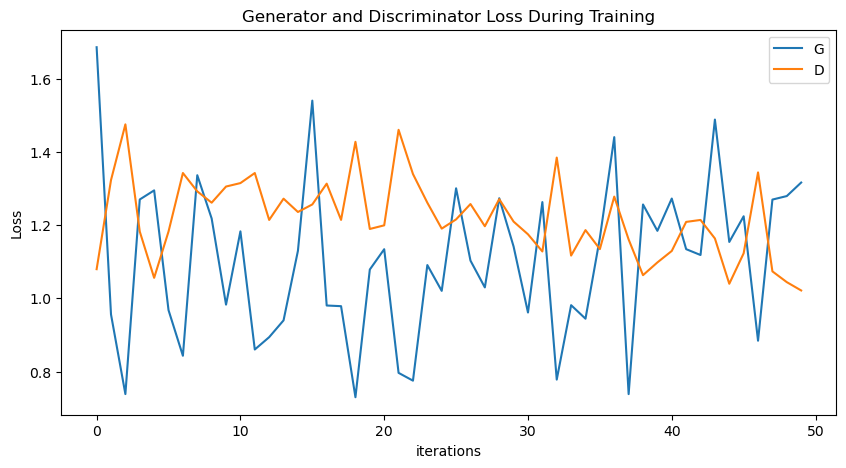
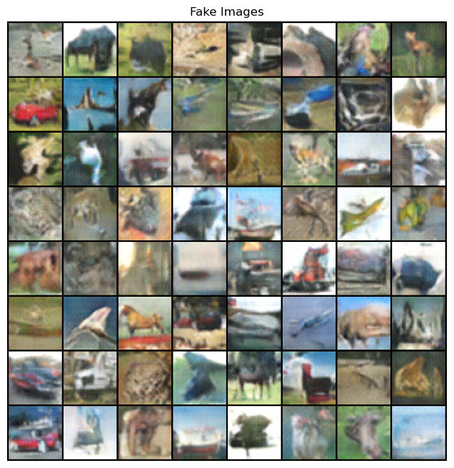
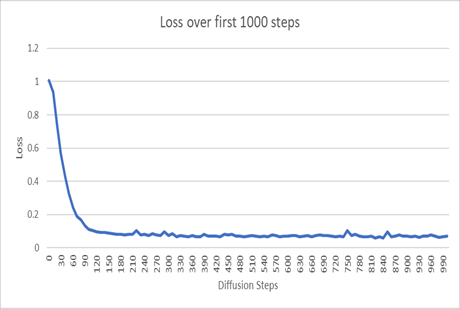
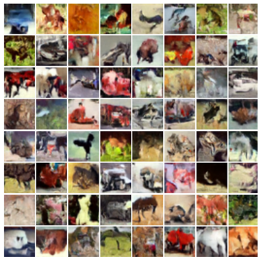
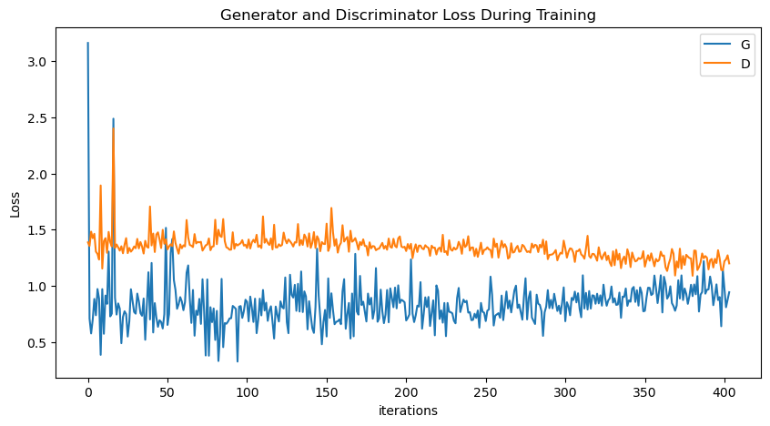
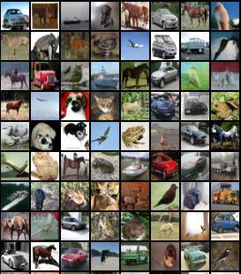

<h1>comparative-diffusion-models<h1>

<h2>Project goal</h2>
This project aims to implement and contrast diffusion models with other generative models like GANs.

Diffusion models are a new class of state-of-the-art generative models that generate 
diverse high-resolution images. We seek to analyze the performance and image quality of 
baseline diffusion models and enhancements based on current research in the field, and compare them
with other generative models like GANs. Diffusion models have recently been used in popular tools like 
DALL-E 2, Imagen, DreamFusion, etc. They are slowly gaining traction, however they have some drawbacks:

1. Slow because of many diffusion steps.
2. High computational cost.
3. High resolution training dataset proportional to high resolution output samples. Not always possible.

We aim to simulate these limitations as well as explore enhancements to correct these.

<h2>Repository structure</h2>
1. requirements.txt: This spells out the libraries required to run the project. They can be installed as follows:
   
   `pip install -r requirements.txt`

You will also need a working MPI implementation installed for the diffusion code to run.
  
2. Training and sampling scripts: We have tried out different approaches which can be run as separate Python files:
 
    <h3>GANs:</h3>

   GANs are a famous class of generative models but they have some drawbacks:
   1. Training instability. 
   2. Mode collapse. 
   3. One-shot learning issue for complex data. 
   4. Overfitting.

   We built GANs from scratch based on the [Pytorch tutorial](https://pytorch.org/tutorials/beginner/dcgan_faces_tutorial.html) mimicking the architecture mentioned in 
[DCGAN](https://arxiv.org/abs/1511.06434) paper. We train the model on CIFAR-10 dataset and then 
sample 50k images. Hyperparams are consistent with other experiments and have been hard-coded as follows:
    
   batch_size = 128
   image_size = 64
   nc = 3
   nz = 100
   ngf = 64
   ndf = 64
   num_epochs = 50
   g_lr = 1.6e-4
   d_lr = 1.25e-4
   beta1 = 0.5
   ngpu=1.

        python -u gans/cifar_gan.py > gans/out/train_test.log
 
    <h3>Classical diffusion models:</h3>
Next, we train a classical diffusion model using the code in the `improved-diffusion` library.
First, navigate into the `improved-diffusion/improved_diffusion` directory and run `pip install -e .` to install the improved_diffusion library as a package. 

Now, you can run the scripts in the `improved-diffusion/scripts` folder to train and sample diffusion models. These scripts are based on https://github.com/openai/improved-diffusion and their usage is as such.

We provide a `flags.sh` file to set up the training, model, and diffusion flags as we set them. You can use this before running the train/sample scripts by running `source flags.sh`. You will also need to run `export OPENAI_LOGDIR="some/output/directory/"` to capture the train/sample output to a specific location. To produce examples similar to ours, run the following:

1. `source improved-diffusion/flags.sh`
2. `export OPENAI_LOGDIR="path/to/outputdir"`
3. `python improved-diffusion/datasets/cifar10.py`
4. `python improved-diffusion/scripts/image_train.py $MODEL_FLAGS $DIFFUSION_FLAGS $TRAIN_FLAGS`
5. (let this run to generate a number of models)
6. `python improved-diffusion/scripts/image_sample.py $DIFFUSION_FLAGS $MODEL_FLAGS --num_samples 1024 --model_path path/to/model.pt`
7. `python improved-diffusion/scripts/npztodir.py /path/to/generated-images.npz /diffusion-images`
8. Download cifar-10 statistics from http://bioinf.jku.at/research/ttur/ttur_stats/fid_stats_cifar10_train.npz
8. `python -m pytorch_fid fid_stats_cifar10_train.npz /diffusion-images`

Training will take a substantial amount of time (usually over 12 hours with one GPU) to reach 10,000 iterations. 
 
    <h3>DDGAN (with improvements):</h3>
    Next we tried NVIDIA's Denoising Diffusion GANs which is supposed to be an enhancement over the
    popular class of denoising diffusion probabilistic models (DDPMs). The idea is to parametrize the 
denoising distribution with a more expressive multimodal distribution instead of simple Gaussian 
distribution. Denoising distributions are modeled with conditional GANs. Thus, it is trained as an 
adversarial setup of generator and discriminator. So we get the performance improvement of GANs with the image
quality of classical diffusion process.

We use NVIDIA's [DDGAN library](https://github.com/NVlabs/denoising-diffusion-gan) with our enhancements over it:
* Gradient accumulation
* Multiprocessing within single GPU
* Hyperparam tuning

Training:

    tmux new-session -d -s my_session_1 \; send-keys "python3 -u denoising-diffusion-gan/train_ddgan.py --dataset cifar10 --exp ddgan_cifar10_exp1 --num_channels 3 --num_channels_dae 128 --num_timesteps 4 --num_res_blocks 2 --batch_size 128 --num_epoch 50 --ngf 64 --nz 100 --z_emb_dim 256 --n_mlp 4 --embedding_type positional --use_ema --ema_decay 0.9999 --r1_gamma 0.02 --lr_d 1.25e-4 --lr_g 1.6e-4 --lazy_reg 15 --num_process_per_node 1 --ch_mult 1 2 2 2 --save_content > denoising-diffusion-gan/out/ddgan_cifar.log" Enter

Sampling:
    
    tmux new-session -d -s my_session_2 \; send-keys "python3 -u denoising-diffusion-gan/test_ddgan.py --dataset cifar10 --exp ddgan_cifar10_exp1 --num_channels 3 --num_channels_dae 128 --num_timesteps 4 --num_res_blocks 2 --nz 100 --z_emb_dim 256 --n_mlp 4 --ch_mult 1 2 2 2 --epoch_id 50 --compute_fid --real_img_dir denoising-diffusion-gan/data/cifar-10-batches-py/ > denoising-diffusion-gan/out/test_ddgan_cifar50.log" Enter
 
  
<h2>Results</h2>

<h3>GANs:</h3>
   Sampling time for 50k images: 2175s

   Log files and results in: gans/out/

   Loss vs Iterations:

   

   Sampling results:

   

  
<h3>Classical diffusion models (with enhancements):</h3>

Sampling time for 1024 images: ~82 minutes.

Loss per iteration:   

Generated images after 2500 timesteps:   

  
<h3>DDGANs (with enhancements):</h3>
   Sampling time for 50k images: 332.65s

   Log files and results in: denoising-diffusion-gan/out

   Loss vs Iterations:

   

   Sampling results:

   
